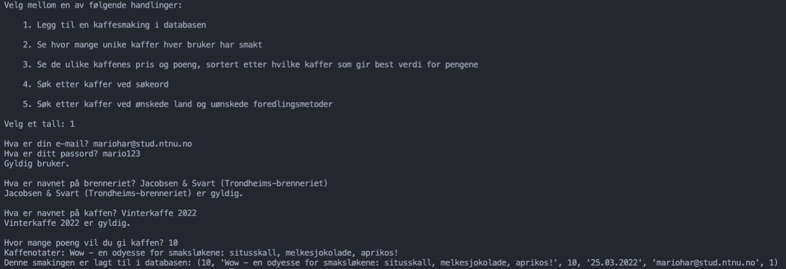
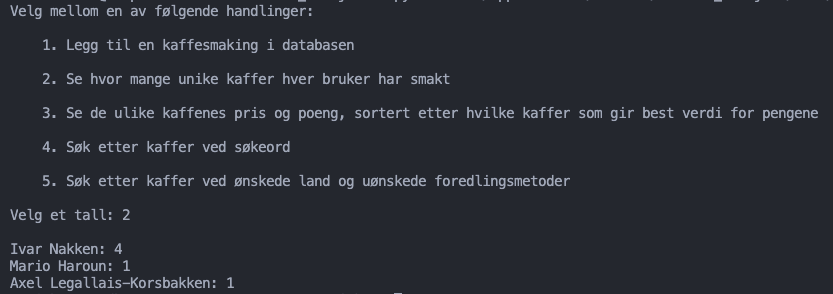
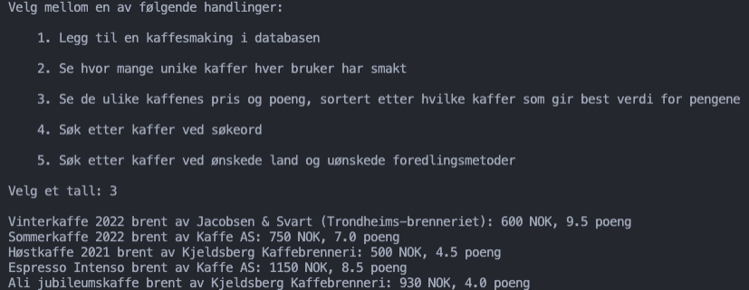
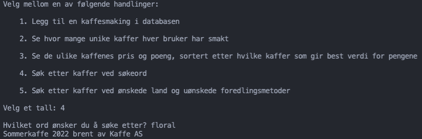
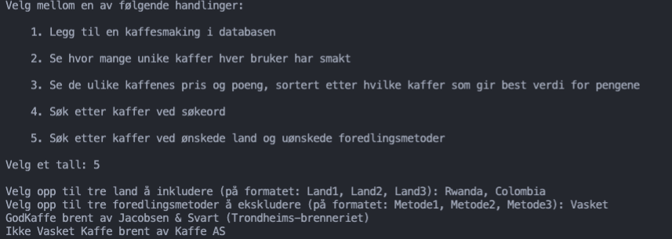

# Prosjektoppgave i TDT4145


## Konvensjoner

:TODO: skriv om sql konvensjoner 

## Beskrivelser

Applikasjonen startes ved å kjøre python filen `sql.py`. Ved oppstart vil bruker bli spurt om å skrive inn et tall mellom 1 og 5, der tallet tilsvarer hvilken brukerhistorie h*n ønsker å kjøre.

### Brukerhistorie 1
> Input fra bruker:
>   - Epost og passord 	
>   - Kaffebrenneri 	
>   - Kaffenavn 	
>   - Poeng 	
>   - Smaksnotat 	

Brukerhistorie 1 starter ved at du taster inn `1` når programmet starter, som kjører `add_tasting()`. Deretter blir du bedt om å logge inn ved hjelp av **Epost** og **Passord**.  Her har vi antatt at bruker må logge inn med en epost som finnes i databasen, med tilhørende passord. Ved feil passord, avsluttes programmet og man må starte på nytt. Dersom en bruker ikke finnes i databasen fra før, blir brukeren spurt om den vil lage en bruker eller avslutte programmet. Hvis brukeren lager en bruker, skal **Epost, Passord, Fornavn og Etternavn** settes inn, og det blir lagt til databasen. 

Så blir brukeren bedt om å taste inn **Kaffebrenneri**. Dersom brenneriet ikke eksisterer i databasen, avsluttes programmet, ellers returenes kaffebrenneri-Id.  

Deretter bes brukeren taste inn **Kaffenavn**. Det sjekkes om den oppgitte kaffeen er brent av det oppgitte kaffeberenneriet. Dette gjøres ved en SQL-spørring som forsøker å finne kaffenavnet:
```
cursor.execute("SELECT Epost from Bruker WHERE Epost = :Epost", 
    {"Epost": usr_epost})
result_user_epost = cursor.fetchone()
```
Så sjekkes det om denne er satt med en if-setning (de andre oppgite verdiene undersøkes på like måte). Dersom det ikke er det, avsluttes programmet.

Så skal bruker oppgi hvor mange **Poeng** den vil gi kaffeen (og det sjekkes at poeng er mellom 1 og 10). 

Vi antar også at brukeren ikke skal velge **Smaksdato** selv fordi det er ikke spesifisert som input i oppgavebeskrivelsen. Derfor blir smaksdato satt til dagens dato ved hjelp av datetime-biblioteket i Python, i stedet for at det skal være NULL. 

Når alt av input er kommet inn, skal all info settes inn i `Kaffesmaking`-tabellen i databasen ved hjelp av følgende kode:
```
cursor.execute("INSERT INTO Kaffesmaking VALUES (?,?,?,?,?,?)",
        (new_tasting_id, notes, points, date_tasted, usr_epost, coffee_id))
connection.commit()
```

Riktig kaffesmakings-Id finner vi å inkrementere største Id-en i  `Kaffesmaking`. Til slutt printes den opprettede kaffesmakingen til brukeren. 


### Brukerhistorie 2

Dersom bruker skriver inn `2` ved oppstart vil vår løsning på brukerhistorie 2 kjøre. Dette innebærer å kjøre SQL-spørringen nedenfor gjennom funksjonen `tasted_count()`, som deretter blir skrevet ut i et ryddig format til bruker. Vi bruker `date.today().year` fra _datetime_-biblioteket for å hente året bruker befinner seg i, som er viktig for å filtrere på kaffesmakinger det siste året. Dette kan gjøres ved å sjekke om året (f.eks. _2022_) befinner seg i smaksdatoen til kaffesmakingen med den logiske SQL operatoren `LIKE`, ettersom det kun er årstall som opptrer med fire tall. Videre grupperer vi på eposten til brukere, da dette er primærnøkkel til Bruker-tabellen og vil være unikt for alle brukere. Ved å gjøre dette kan vi telle opp antall rader tilhørende hver gruppe med `COUNT`, for så å sortere resultatet synkende med `ORDER BY _ DESC`.

### Brukerhistorie 3

Dersom bruker skriver inn `3` ved oppstart vil vår løsning på brukerhistorie 3 kjøre. Dette innebærer å kjøre SQL-spørringen nedenfor gjennom funksjonen `best_deal()`, som deretter blir skrevet ut i et ryddig format til bruker. Vi må gruppere på kaffe sin unike id slik at vi kan regne ut gjennomsnittsscore på kaffen hentet fra alle kaffesmakinger. Vi antar derfor at en kaffe som ikke har kaffesmaking, ikke skal være med i resultatet, og derfor er det noen kaffer som ikke er med, fordi de ikke er smakt av brukere. Når vi til slutt sorterer resultatet er det viktig å ta gjennomsnittet delt på kaffeprisen, da det vil si noe om hvor mye kaffen gir iforhold til prisen, noe brukerhistorien etterspør. `DESC` vil sortere synkende.  

### Brukerhistorie 4
> Input fra bruker:
> - Nøkkel (søkeord)

Brukerhistorie 4 starter man ved å taste inn `4` ved begynnelsen av programmet. Her blir brukeren først bedt om å taste inn et _søkeord_. Vi bruker `SELECT DISTINCT` for å unngå å få likt resultat flere ganger. Deretter slår vi sammen tabellene `Kaffe`, `Kaffesmaking` og `Kaffebrenneri`. Videre filtrerer vi tabellen på om enten Kaffebeskrivelse eller Kaffesmakingsnotater (som er attributter i henholdsvis Kaffe og Kaffesmaking) inneholder det oppgitte søkeordet. Brukeren får da en liste over alle kaffer og hvilket brenneri de er brent av. Dersom ingen kaffer eller kaffesmakinger inneholder søkeordet, printes ingenting ut til bruker.

For å få resultet som er beskrevet i brukerhistorie 4, skriver en «floral» ved input av søkeord. 

### Brukerhistorie 5
> Input fra bruker: 
> - Fra ett til tre land
> - Fra én til tre foredlingsmetoder

For å kjøre brukerhistorie 5, taster man inn `5` ved begynnelsen av programmet, som kjører `filter_methods_and_countries()`. Først tar programmet inn ett eller tre _land_ som input fra bruker, og deretter én eller tre _foredlingsmetoder_. Vi velger ut brennerinavn og kaffenavn fra `Kaffebrenneri` og `Kaffe`, og starter med å slå sammen tabellene Kaffebrenneri, Kaffe, Kaffeparti, Gård, Region, Land og til slutt Foredlingsmetode. Deretter filtrere vi på de ønskede land(ene) som ikke har de/den oppgitte foredingsmetoden(e). Her antar vi skal oppgi kaffer fra de landene som ikke har de oppgitte foredlingsmetodene, altså at det ikke skal være samme kaffe som kommer fra f.eks. Rwanda og Colombia og som ikke har oppgitt foredlingsmetode, men at kaffene kan være forskjellige fra de oppgite landa. Til slutt skrives ut en liste av kaffen og hvilket brenneri det er brent av på et ryddig format. 

For å få resultatet som er beskrevet i brukerhistorie 5, kan en skrive inn "Rwanda" og "Colombia" på land-input og "Vasket" på foredlingsmetoder-input. 

## Resultater

### Resultat fra brukerhistorie 1
Her taster man inn slik som vist på bildet, og til slutt printes det som ble lagt til:



### Resultat fra brukerhistorie 2 
Her bare starter man python-koden og trykekr `2`. Slik ser resultatet ut:



### Resultat fra brukerhistorie 3
På brukerhistorie 3 tenger du også å bare taste inn `3` ved oppstart av programmet. Her er resultat for brukerhistorie 3:



### Resultat fra brukerhistorie 4
Slik det er beskrevet i oppgavebeskrivelsen, vil brukeren taste inn søkerdet "floral" (men programmet kan ta inn hvilket som heltst søkeord). Slik vil det se ut med input og output: 



### Resultat fra brukerhistorie 5
I oppgaveteskten øsnker brukeren å finne kaffer som ikke er vasket (foredlingsmetode) og som kommer fra Rwanda og Colombia. Etter å taste inn `5`, taster man inn landene **Rwanda** og **Colombia**, og på foredlingsmetode **Vasket**: 

